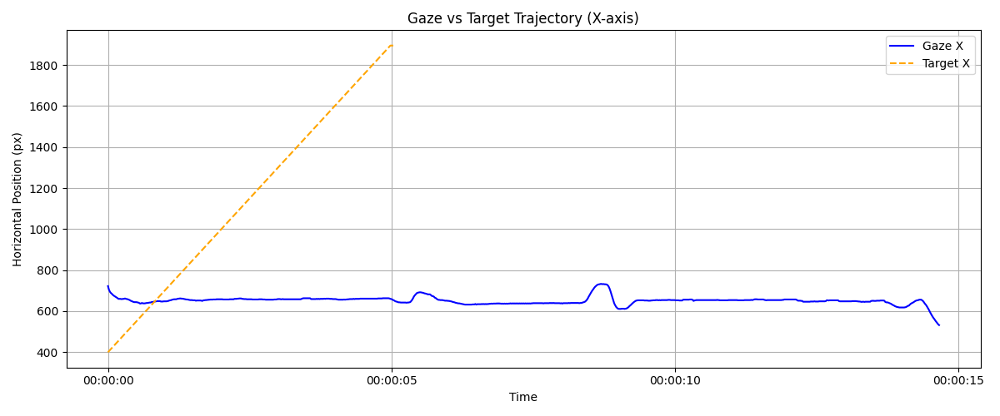
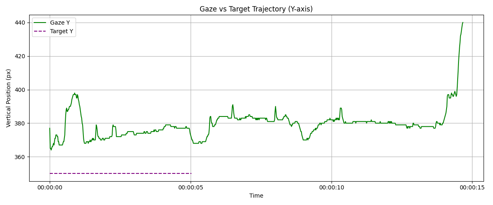
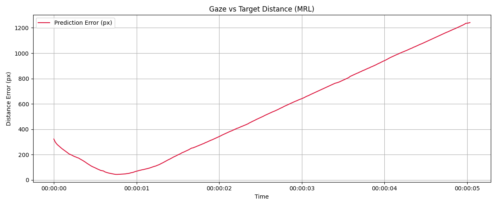

# 🧠 AI-Parkinson-Diagnosis

This project analyzes eye movement data to estimate Parkinson’s disease severity using simple vision-based tracking.

---

## 📁 Project Structure
├── scripts/ # Python scripts
├── data/ # Raw and processed CSV data
├── figures/ # Output visualizations
├── README.md # Project overview


## 🧪 Features

- ✅ Eye tracking using webcam
- ✅ Target-following mock generator
- ✅ Gaze vs Target comparison (MRL-based error)
- 📊 Visualization with Matplotlib
- 🚧 IMU data integration (in progress)

---

## 📷 Example Visualizations

  
  


---

## 🚀 How to Run

```bash
# 1. Generate target movement
python3 scripts/make_dummy_target.py

# 2. Run eye-tracking and collect data
python3 scripts/eye_analysis.py

# 3. Compare gaze vs target
python3 scripts/compare_eye_to_target.py
```
